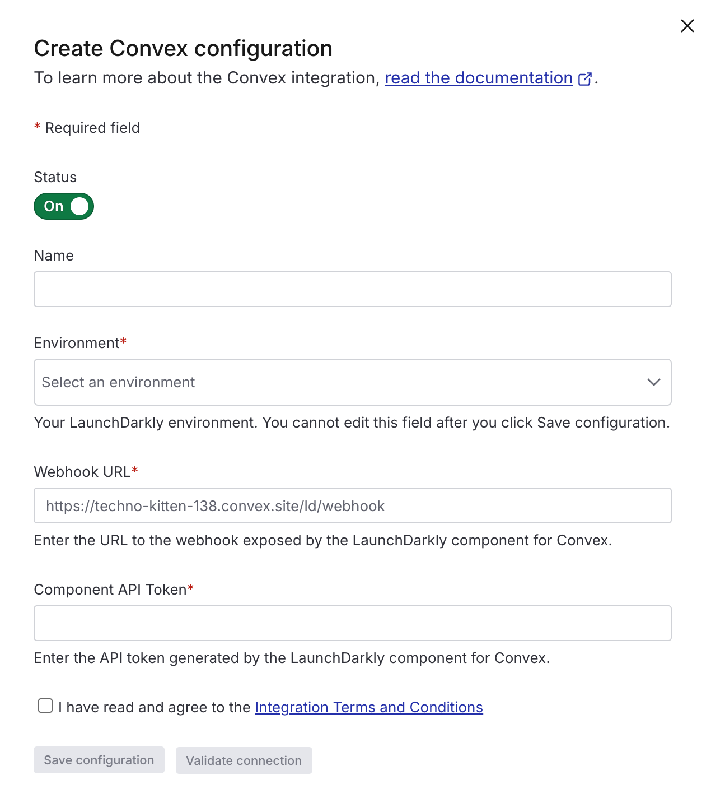

# LaunchDarkly Convex Component

This is a Convex component for [LaunchDarkly](https://launchdarkly.com). It syncs your LaunchDarkly environment to your Convex deployment, allowing you to use your feature flags in Convex.

## Prerequisites

### LaunchDarkly account

To use the LaunchDarkly Convex component, you'll need a LaunchDarkly account. Your LaunchDarkly subscription must include access to integrations.

### Convex App

You'll need a Convex App to use the component. Follow any of the [Convex quickstarts](https://docs.convex.dev/home) to set one up.

## Installation

### Install and configure the component package

```bash
npm install @convex-dev/launchdarkly
```

Create a `convex.config.ts` file in your app's `convex/` folder and install the component by calling `use`:

```typescript
// convex/convex.config.js
import { defineApp } from "convex/server";
import launchdarkly from "@convex-dev/launchdarkly/convex.config.js";

const app = defineApp();

app.use(launchdarkly);

export default app;
```

Register webhooks by creating an `http.ts` file in your `convex/` folder and use the client you've exported above:

```typescript
// http.ts
import { httpRouter } from "convex/server";
import { registerRoutes } from "@convex-dev/launchdarkly";
import { components } from "./_generated/server";

const http = httpRouter();

// You may pass a third parameter here to override the default path of `/ld/webhook`
registerRoutes(components.launchdarkly, http);

export default http;
```

This will register two webhook HTTP handlers in your your Convex app's deployment:

- `GET YOUR_CONVEX_SITE_URL/ld/webhook` - LaunchDarkly will use this endpoint to verify the installation of your component.
- `PUT YOUR_CONVEX_SITE_URL/ld/webhook` - LaunchDarkly will send your flag and segment data to this endpoint.

Copy your LaunchDarkly environment's SDK Key and store it as an environment variable (e.g. `LAUNCHDARKLY_SDK_KEY` in your Convex deployment. You can do so on the [environment variables](https://dashboard.convex.dev/deployment/settings/environment-variables) page.

### Configure the LaunchDarkly integration

Once you've installed the component, make sure you push your changes to your Convex app:

```bash
npx convex dev
```

Generate a shared secret to be used by the LaunchDarkly integration. This will ensure the payloads sent to your webhook are coming from LaunchDarkly.

```bash
npx convex run --component-path=launchdarkly tokens:generate
```

You can now configure the LaunchDarkly integration. On the [Integrations page](https://app.launchdarkly.com/settings/integrations) of the LaunchDarkly dashboard, search for Convex and click "Add Integration".

Each of your Convex deployments (e.g. Production and other developer's environments) will need their own integration configured in LaunchDarkly.



Select a name and environment for the integration.

For "Component API Token", use the shared secret you generated earlier.

Once you save, you can open the integration form again and click the Validate button to test the connection. If you encounter errors, check the logs page in the Convex dashboard for more information.

For "Webhook URL", use your deployment's HTTP Actions URL suffixed with the path provided to the `registerRoutes` call in your `http.ts` file. By default, the path is `/ld/webhook`. You can retrieve your HTTP Actions URL on the [Deployment Settings page](https://dashboard.convex.dev/deployment/settings) of the Convex dashboard. Example: https://techno-kitten-138.convex.site/ld/webhook

### Using the LaunchDarkly component

You may initialize the LDClient class with the component configuration and use the LaunchDarkly SDK as you would in a normal JavaScript application.

```typescript
import { LDClient } from "@convex-dev/launchdarkly";
import { components, query } from "./_generated/server";

export const myQuery = query({
  args: {},
  handler: async ({ ctx }) => {
    const launchdarkly = new LDClient(
      components.launchdarkly,
      ctx,
      process.env.LAUNCHDARKLY_SDK_KEY!
    );
    const res = await launchdarkly.allFlagsState({ key: "myUser" });
    return res.allFlagValues();
  },
});
```

#### LaunchDarkly Events

As noted in the examples above, queries are unable to send events to LaunchDarkly. If you would like to have the SDK send events to LaunchDarkly (e.g. flag evaluation insights and for experimentation), you should use LaunchDarkly in a mutation or action instead.

## Example App

You can run the example in the `examples` folder to see how the LaunchDarkly component works.

```bash
cd example
npm install
```

Follow the instructions above for [configuring the LaunchDarkly integration](#configure-the-launchdarkly-integration) and then run the example:

````bash
In seperate terminals:

```bash
npm run cvx
````

```bash
npm run dev
```

## Production

When you're ready to deploy your app to production with LaunchDarkly, be sure to follow all the setup steps for produciton, including adding the `LAUNCHDARKLY_SDK_KEY` evnironment variable and configuring an additional shared secret and integration for Production. You'll want this to be configured before any of your code relies on the LaunchDarkly flags.

You may use this command to generate your production secret:

```bash
npx convex run --component-path=launchdarkly --prod tokens:generate
```

## Syncing multiple LaunchDarkly environments in one Convex app

If you have multiple LaunchDarkly environments, you can create a separate component configuration for each environment.

```typescript
// convex/convex.config.js
import { defineApp } from "convex/server";
import launchdarkly from "@convex-dev/launchdarkly/convex.config.js";

const app = defineApp();

app.use(launchdarkly, {
  name: "first",
});

app.use(launchdarkly, {
  name: "second",
});

export default app;
```

Be sure to also update your `http.ts` file to register the routes for each component:

```typescript
// http.ts
import { httpRouter } from "convex/server";
import { registerRoutes } from "@convex-dev/launchdarkly";
import { components } from "./_generated/server";

const http = httpRouter();

registerRoutes(components.first, http, "/ld/first");
registerRoutes(components.second, http, "/ld/second");

export default http;
```

Then you can generate a separate shared secret for each environment:

```bash
npx convex run --component-path=first tokens:generate
npx convex run --component-path=second tokens:generate
```

These secrets can be plugged into seperate integration configurations in LaunchDarkly.

once configured, you may initialize `LDClient` with the appropriate component configuration:

```typescript
import { LDClient } from "@convex-dev/launchdarkly";

export const myQuery = query({
  args: {},
  handler: async ({ ctx }) => {
    const launchdarklyFirst = new LDClient(components.first, ctx, process.env.LAUNCHDARKLY_SDK_KEY!);

    const launchdarklySecond = new LDClient(components.second, ctx, process.env.LAUNCHDARKLY_SDK_KEY_2!);

    ...
  },
});
```

## Unsupported features

- Big segments
- Diagnostic events
